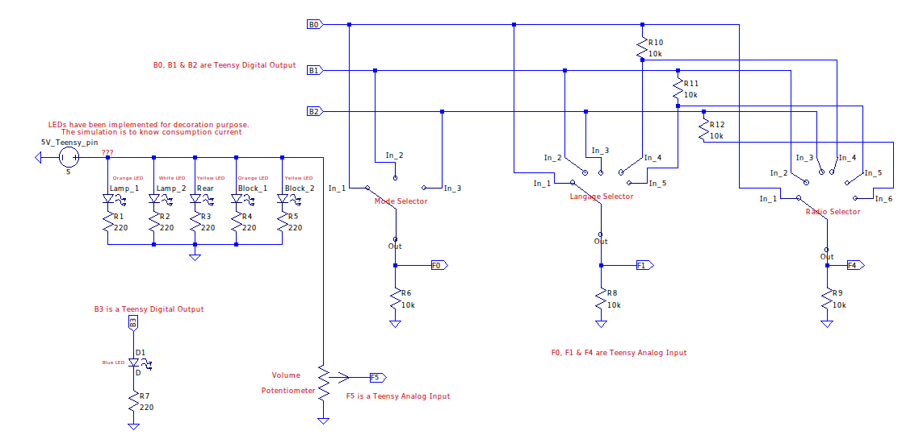

# Radio
Old radio refurbishment

## Project Description

I'm refurbishing the following 1954 radio: 

At the end of the project, the radio can:
- Play (up to 9) webradios from different countries (up to 5), for a total of 45 webradios
- Pair and then stream bluetooth from smarthpone
- Listen music from  a 3.5mm jack connector input

The radio has 4 buttons:
- A [voltage selector](/images/radio_voltage_selector.jpg) at radio rear which will be used to select radio langage. A position change when bluetooth mode is activated result in bluetooth pairing
- A [5 position switch selector](/images/radio_left_buttons.jpg) at radio bottom left: the selector is tuned to select only three positions for the 3 mode: webradio, bluetooth, jack 
- A [6 position switch selector](/images/radio_right_button.jpg): to select the different webradio
- A [ON/OFF/potentiometer button](/images/radio_left_buttons.jpg) at radio upper left: to switch ON/OFF radio adn to change volume

The radio has 2 "brain":
- A [Teensy2](https://www.pjrc.com/store/index.html) (equivalent to arduino nano) to read positions of buttons thanks to digital output and analog input
- A [Raspberry Pi 4 2Gb](https://www.raspberrypi.org/products/raspberry-pi-4-model-b/). With a python script, the raspberry:
  * Read informations coming from teensy (via USB)
  * Launch [VLC](https://www.videolan.org/vlc/index.html) to stream webradio or to listen jack input
  * Pair bluetooth devices
  * Stream bluetooth music coming from devices
  * Output the sound to an [Hifiberry Amp 2](https://www.hifiberry.com/shop/bundles/hifiberry-amp2-bundle-4/)

To highlight best parts of the radio, several LEDs powered by Teensy have been installed (see night results on [front image](/images/radio_leds_on.jpg) and [rear image](/images/radio_leds_on_2.jpg)):
- Inside each lamp
- Inside the 2 aluminium block
- Next to rear voltage selector to see what voltage is selected

## Hardware description

The following synoptic presents links between main hardware parts: 

For memory (or to duplicate the project), schematics showing each connection between Teensy and selectors/buttons/LEDs are below presented: 

