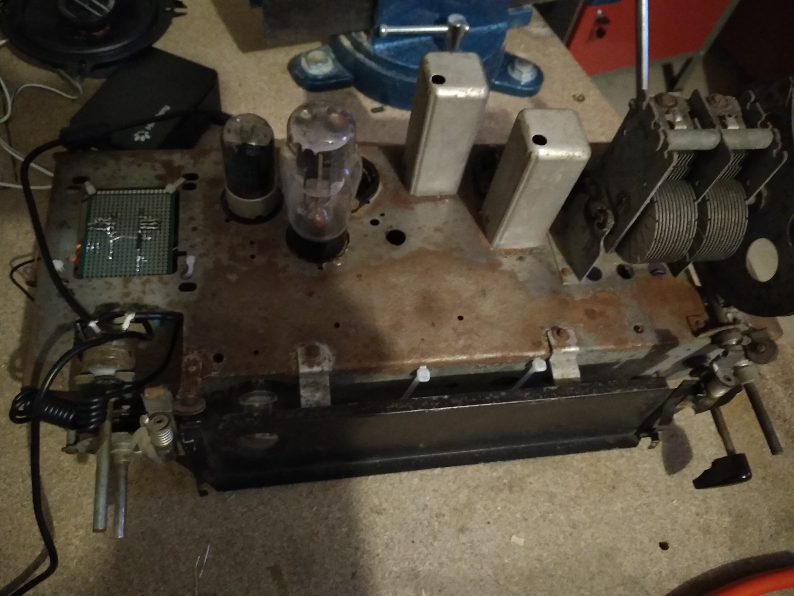

# Radio
Old radio refurbishment

## Project Description

I'm refurbishing the following 1954 radio: 

At the end of the project, the radio can:
- Play (up to 9) webradios from different countries (up to 5), for a total of 45 webradios
- Pair and then stream bluetooth from smarthpone
- Listen music from  a 3.5mm jack connector input

The radio has 4 buttons:
- A voltage selector at radio rear which will be used to select radio langage. A position change when bluetooth mode is activated result in bluetooth pairing
- A 5 position switch selector: the selector is tuned to select only three positions for the 3 mode: webradio, bluetooth, jack 
- A [6 position switch selector](/images/radio_right_button.jpg): to select the different webradio
- A ON/OFF/potentiometer button: to switch ON/OFF radio adn to change volume

The radio has 2 "brain":
- A Teensy2 (equivalent to arduino nano) to read positions of buttons thanks to digital output and analog input
- A Raspberry Pi 4 2Gb. With a python script, the raspberry:
  * Read informations coming from teensy
  * Launch VLC to stream webradio or to listen jack input
  * Pair bluetooth devices
  * Stream bluetooth music coming from devices
  * Output the sound to an [Hifiberry Amp 2](https://www.hifiberry.com/shop/bundles/hifiberry-amp2-bundle-4/)

To highlight best parts of the radio, several LEDs powered by Teensy have been installed:
- Inside each lamp
- Inside the 2 aluminium prominence
- Next to rear voltage selector to see what voltage is selected
